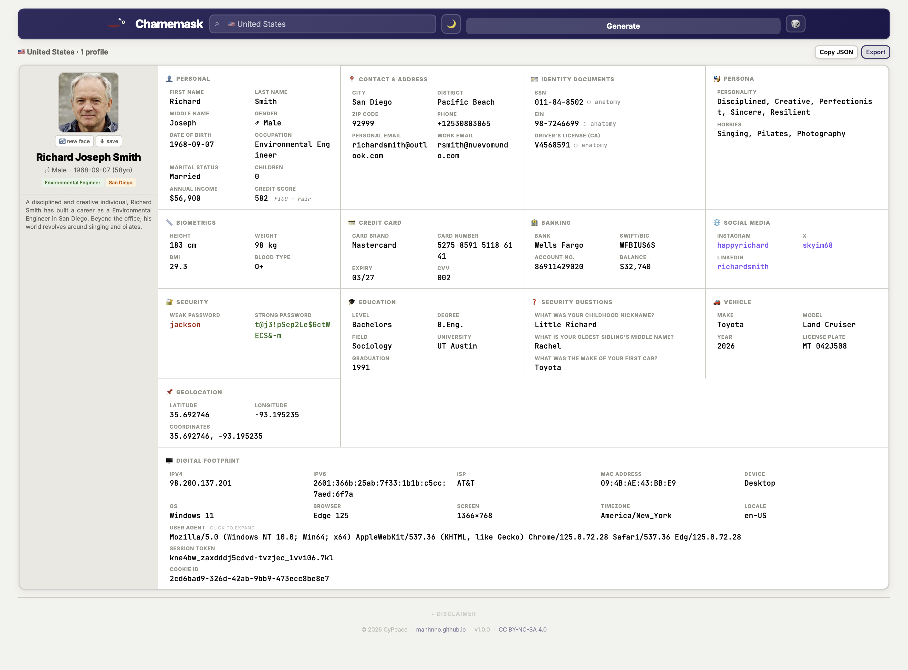

# Chamemask

Fake identity generator. 102 countries, one HTML file, no setup.

Pick a country, hit Generate. You get a full fake profile where everything is linked: the job decides the income, the income decides the car, the car gets a plate in the right format for that country. Government workers get `.gov` emails, professors get university domains. ID numbers pass real checksum algorithms. Names match the culture. The avatar matches the ethnicity.

**All data is fictional. Not for fraud or impersonation.**

## Live Demo

[https://manhnho.github.io/Chamemask](https://manhnho.github.io/Chamemask)

<p align="center">
  
</p>

## Usage

Open `index.html` in a browser. Pick a country, hit Generate.

- Click any field to copy
- Click an ID number to see its anatomy (which digits are DOB, gender, region, checksum)
- Hit **new face** to get a different avatar, **save** to download it
- Export up to 1,000 profiles as JSON, CSV, or SQL

## What's in a profile

| Section | What you get |
|---------|-------------|
| **Personal** | Name, gender, DOB, occupation, marital status, children, income, credit score |
| **Contact** | City, district, ZIP, phone, personal email, work email |
| **Identity Documents** | National ID, tax ID, driver's license (real checksums: Luhn, Verhoeff, Mod-11, ISO 7064) |
| **Persona** | Personality traits, hobbies |
| **Biometrics** | Height, weight, BMI, blood type |
| **Credit Card** | Brand, number (valid Luhn), expiry, CVV |
| **Banking** | Bank, SWIFT/BIC, account number, IBAN, balance |
| **Social Media** | Up to 5 accounts (respects censorship: no Twitter in China, adds Zalo for Vietnam, Line for Japan) |
| **Security** | Weak password, strong password |
| **Education** | Degree, field, university, graduation year |
| **Security Questions** | 3 Q&A pairs (answers use local names and places) |
| **Vehicle** | Make, model, year, license plate in country format |
| **Geolocation** | Lat/lng within the country |
| **Crypto Wallet** | BTC + ETH addresses and balances (younger profiles more likely to have one) |
| **Digital Footprint** | IP, ISP, MAC, device, OS, browser, user agent, timezone, session token, cookie ID |
| **Short Bio** | A paragraph tying everything together |

103 occupations. Job titles in native language for 60 countries (19 languages). Non-Latin names (CJK, Cyrillic, Arabic, Thai) include romanization.

## How fields connect

- **Job** decides work email domain (`.gov.*`, `.edu.*`, hospital, or private sector), income tier, education level, and vehicle class
- **Income** decides car brand tier (economy to luxury) and bank balance range
- **Age** gates senior jobs (surgeon, judge, pilot require 23+), affects crypto adoption rate, determines graduation year
- **Country** decides name pool, address format, ZIP format, phone prefix, ID algorithm, ISP, timezone, social media platforms, license plate format, university list
- **ID numbers** encode the actual DOB, gender, and region from the same profile

## Use cases

**QA/Dev.** Seed databases, fill forms, test i18n. Names in Cyrillic, Arabic, CJK. Phone numbers with correct prefixes. Better than `John Doe` and `123 Main St`.

**Security.** Pentest registration flows, KYC screens, identity verification. Data passes format checks without using real PII. Also works for honeypot datasets and CTF challenges.

**Privacy.** Don't trust a service? Sign up with a fake profile instead.

**Just for fun.** Hit the random button a few times. It's weirdly addictive.

## Project structure

```
Chamemask/
  index.html           The whole app. 4,200 lines, vanilla JS, no build step.
                        All data, generators, UI, and export in one file.
                        Only external dependency: Google Fonts (optional).

  face_catalog.json     AI-generated face photos indexed by race/sex/age.
                        6,747 images across 48 categories.

  fetch_faces.py        Script to pull more face photos from
                        thispersonnotexist.org API. Merges with existing
                        catalog, deduplicates automatically.

  demo/
    chamemask-screenshot.png  Screenshot for this README.

  README.md
```

## Technical notes

- Single HTML file, vanilla JS, no framework
- 102 countries, 7 regions, 103 occupations, 19 localized languages
- Dark/light theme, follows system preference
- Responsive, 320px to ultrawide
- Works as iOS/Android PWA
- Avatars from [thispersonnotexist.org](https://thispersonnotexist.org/), AI-generated, no real people
- Works offline (fonts fall back to system fonts)

## Disclaimer

All profiles are fake. Don't use them to impersonate anyone. If you do something illegal with this, that's on you.

## Built with

Vibe-coded with [Claude](https://claude.ai) by [@ManhNho](https://github.com/ManhNho).

## License

[CC BY-NC-SA 4.0](https://creativecommons.org/licenses/by-nc-sa/4.0/). Free for non-commercial use. Commercial licensing: [@ManhNho](https://t.me/ManhNho) · [manhnho.github.io](https://manhnho.github.io)
